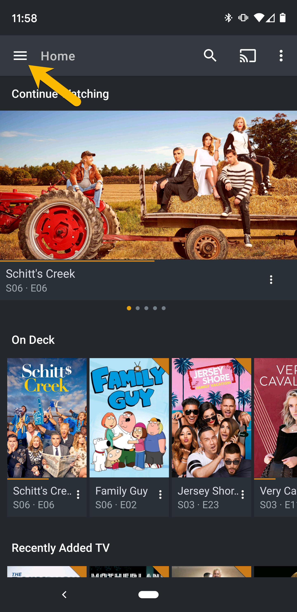
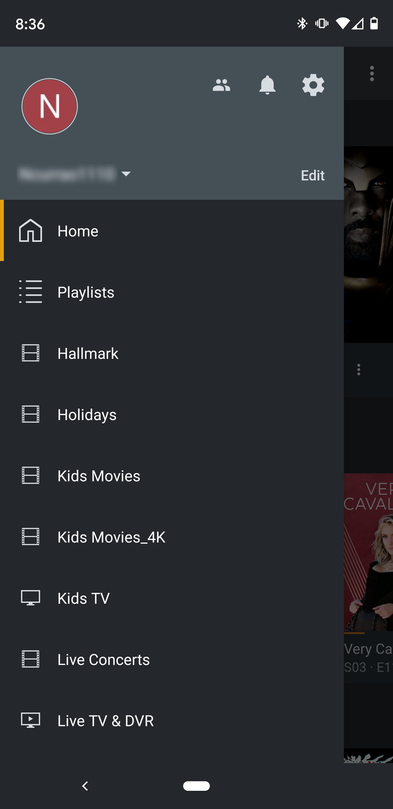
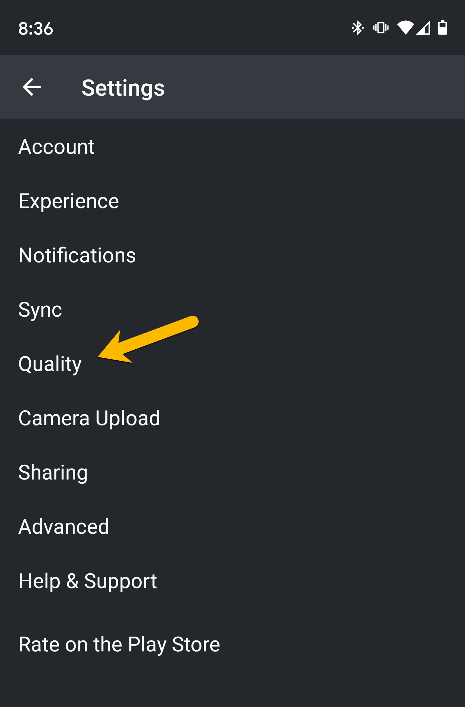
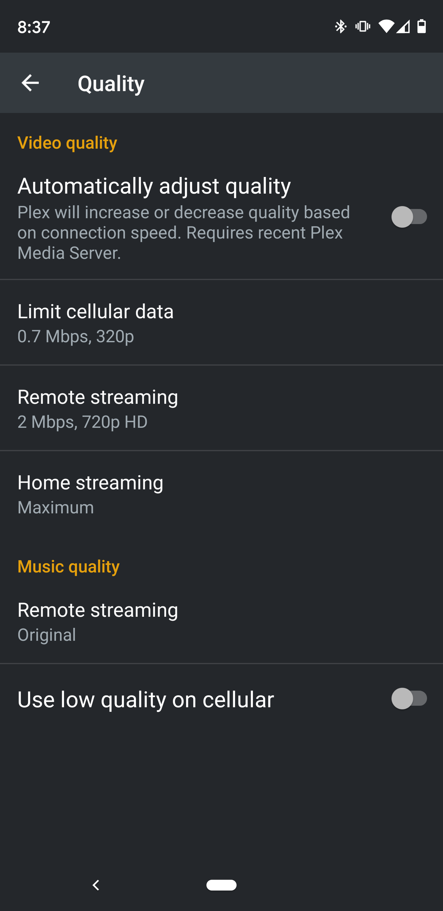
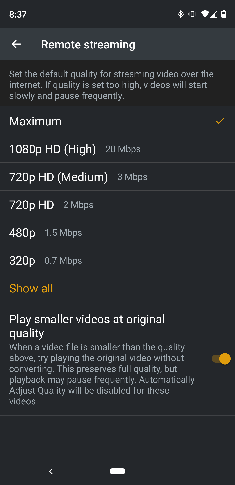
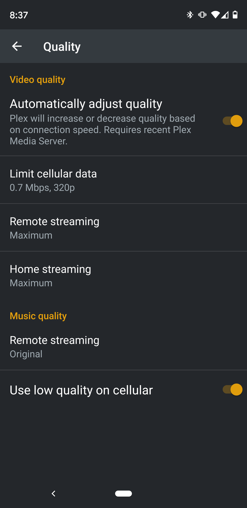

Follow the steps below in order to change the Plex video quality settings on an Android Mobile device. From the home screen hit the "hamburger menu" button in the upper left hand corner.

From there find the settings icon that looks like a Gear on the menu screen that slides out from the left.

From the Settings menu find and select the Quality section:

Below is what you should see when you first open the Quality Menu section:

We have to change a few things here: First click on Remote Streaming, now you'll notice that there isn't an option for Original or Maximum like a lot of the other device. That's because it's hidden by default.

• Select the Show All menu option

Then you will see the option we are looking for:

- Select Maximum

For the rest of the settings match your screen with the one below

- Cellular data settings are optional to your data plan requirements.

Hit the < in the upper left and you are ready to stream