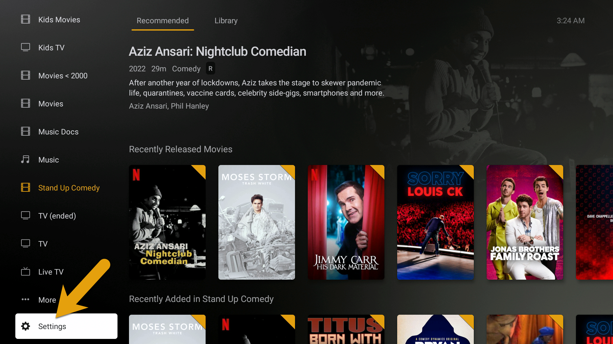

In order to change the Plex video quality settings on your Nvidia shield, Xiaomi Mibox or similar, simply find the “Settings” menu option at the bottom of the home screen in Plex.

### Device Settings

**Settings > Video Quality**

- Adjust automatically > OFF
- Home streaming > Maximum
- Remote streaming > Maximum

---

Credit: [https://mediaclients.wiki/](https://mediaclients.wiki/)