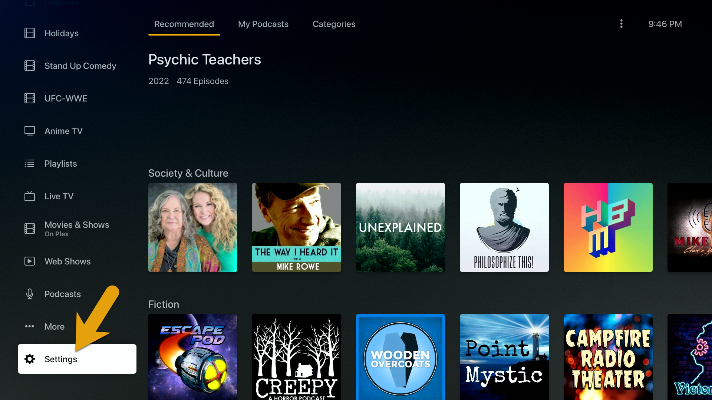
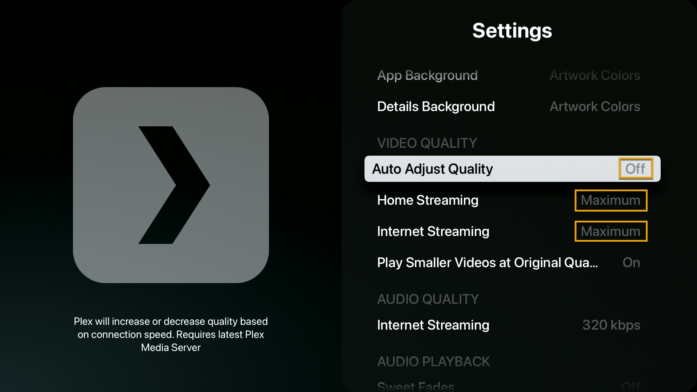

In order to change the Plex video quality settings on your Apple TV device, simply find the “Settings” menu option at the bottom of the home screen in Plex.

### Device Settings

**Settings > Video Quality > Internet Streaming**

- Auto Adjust Quality > Off
- Local Quality > Maximum
- Remote Quality > Maximum

---

Credit: [https://mediaclients.wiki/](https://mediaclients.wiki/)