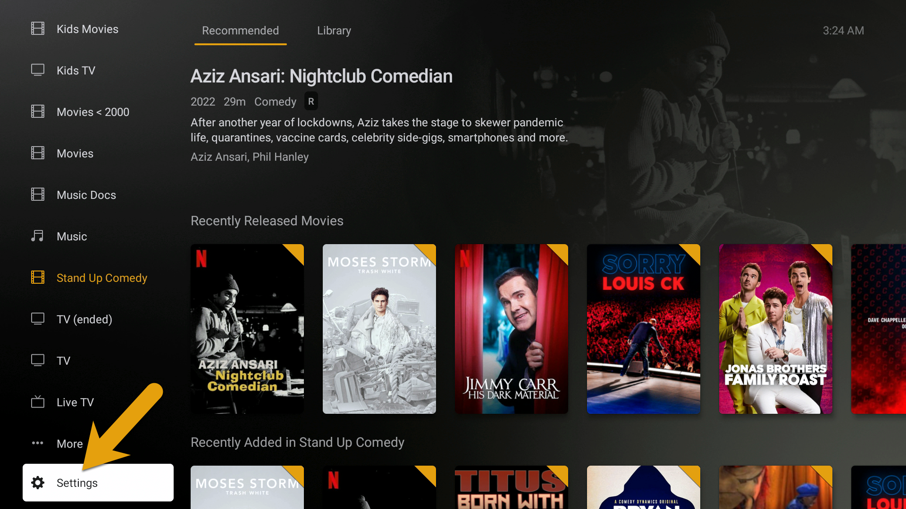
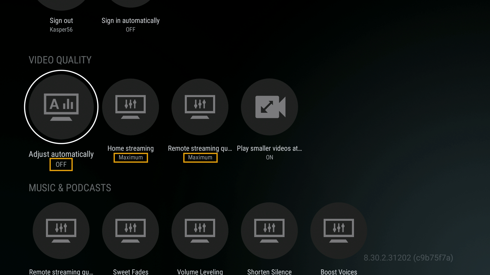

In order to change the Plex video quality settings on your Amazon FireTV device, simply find the “Settings” menu option at the bottom of the home screen in Plex.

### Device Settings

**Settings > Video Quality**

- Adjust automatically > OFF
- Home streaming > Maximum
- Remote streaming > Maximum

---

Credit: [https://mediaclients.wiki/](https://mediaclients.wiki/)