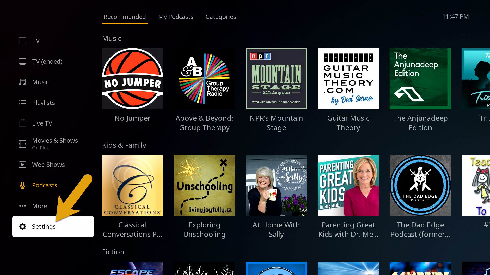

In order to change the Plex video quality settings on your Roku device, simply find the “Settings” menu option at the bottom of the home screen in Plex.

### Device Settings

**Settings > Video**

- Local Quality > Original
- Remote Quality > Original
- Direct Play > Auto
- Allow Direct Stream > Checked

---

Credit: [https://mediaclients.wiki/](https://mediaclients.wiki/)