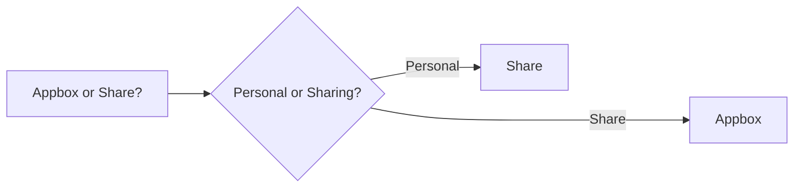

<figure markdown>
{ width=500 }
    <figcaption>Set sail for smooth streaming seas with Blackbeard Media.</figcaption>
</figure>

# Getting Started with Plex Shares and Appboxes

Welcome to the Blackbeard Media documentation website! This site is designed to provide you with all the information you need to get the most out of your streaming service, whether you're a share user, an appbox user, or just curious about what there is out there.

Whether you're a new user just getting started with the Plex app and the world of Plex shares or an experienced user looking to fine-tune your settings, we've got you covered. Our guides will walk you through the initial setup process, show you how to configure your devices for optimal playback, and go over other features of Plex such as filters, collections, and playlists.

If you're an appbox user, we've got you covered too. Our guides will walk you through the initial setup process, including recommended settings for your appbox, and show you how to utilize the Kronos dashboard. We'll also help ensure you have all content scanned in and provide information about Plex Meta Manager to organize your media. Whether you're new to appboxes or an experienced user, we'll provide you with the information you need to get the most out of your streaming experience.

We hope this documentation will be a valuable resource for you as you explore the world of streaming. If you have any questions or feedback, please don't hesitate to contact us on Discord.

