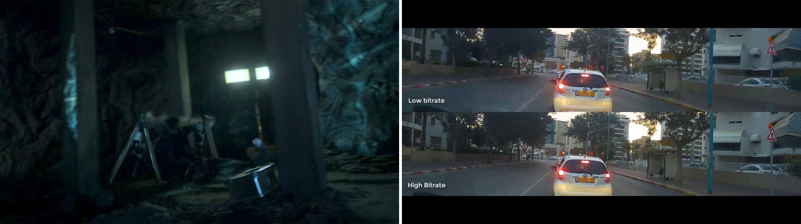

# Transcode vs Direct Play

## Transcode

If you play video via Plex and reduce the streaming quality to anything lower then its original quality, then the video will be considered to be "transcoding"; Plex is essentially taking the original file and converting it to a different file that you can stream. This requires processing power resources from a server. Video can be transcoded due to a variety of reasons:

### Slow Connection

If the connection from your client to a Plex server only allows for 10Mbps, and if the file you are playing is averaging 40Mbps, the Plex server will attempt to transcode the HQ video into a 10Mbps stream so that you can get smooth playback without stuttering, pausing, or buffering. This is usually most apparent on slower connections or on mobile devices with slow roaming connections.

### Client Support

Without getting too technical, each client (TV, phone, PC, web player, etc.) and the different Plex apps have different capabilities based on your device's codec support. What this means is that if you attempt to play Video A (encoded in the H.265 codec) on Client A, and this Client A doesn't support that codec, it will transcode it to a different codec that it can play, once again requiring server resources.

### Subtitles

Similar to the above point, some clients don't support being able to display the video stream and the subtitle stream at the same time, and so, if you turn on subtitles, Plex will create a second video with the subtitles burned in, so that your client sees the two streams merged as one, and is able to show subtitles. This is considered transcoding.

## Direct Play / Stream

Direct playing is streaming of video exactly in the format stored on the server, with no transcoding. This requires relatively little server resources (CPU/GPU), but will require usually more upload bandwidth, since you're streaming it in the original quality. This is the ideal way of playing content since most servers usually have more bandwidth than CPU/GPU resources. Not only is it better for the server, it is also best for YOU. You get to view content in the highest original quality, the quality that you are quite possibly paying for. 

Direct streaming is when you are direct playing the video but the transcoding audio of the file. This doesn't strain the server much and when shares mention 'No Transcoding', they're typically only referring to video transcoding - so direct streaming can usually be considered the same as direct playing for all intents and purposes.

## What does this actually mean to me when joining a share?

When joining a share, server owners usually explicitly mention which of these you're allowed to do and how much of each. Let's break down an example:
A share allows 2 direct plays / 1 transcode: This means at any given time you will be able to have two devices direct playing content, and one of them may transcode video, just not both at the same time.

> **Transcoding 4K:** You'll often see shares explicitly disallow video transcoding of 4k content, and for good reason. It stresses the resources of the server to an extreme amount. A single 4K transcode the resources enough for ~8x 1080p transcodes. Worst of all, the quality of the 4K is stream is severely compromised, AND Plex is unable to tonemap HDR properly, which leads to a washed out image, as seen below.

## How to Avoid Transcoding

So enough about the evils of transcoding, how do you actually avoid it? As I mentioned earlier, this is usually dependent on the device's capability and the application you are using. But for most devices, you should be able to avoid transcoding, simply by going into Settings > Video > Set quality to Original/Maximum/Direct Play only. We will go further the settings for each client in the [client settings section](../clients/index.md). into If your device doesn't support it, enabling subtitles can also sometimes lead to transcoding. The best way to avoid these issues is to use the devices, which have the highest compatibility and support for a wide variety of formats. Here are some general good devices and tips:

- When on a computer, ALWAYS try to use the Plex Media Player app, instead of the browser players (ie. Chrome). You will get tone-mapping support, subtitle support, and better video/audio support. You will almost never transcode when using the official app.
- The NVidia shield and Apple TV 4K (w/ Infuse) are heralded as the best TV boxes in terms of direct play support, ability to play 4K, HDR, and much much more.
- There are also other cheaper Android TV boxes that CAN work well, but make sure to research further into these to ensure they are able to do what you want (i.e., Atmos audio, subtitle support, x265 support, etc.)
