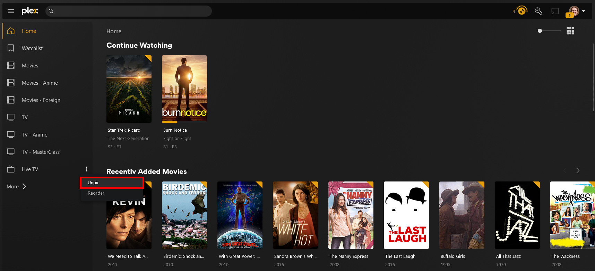
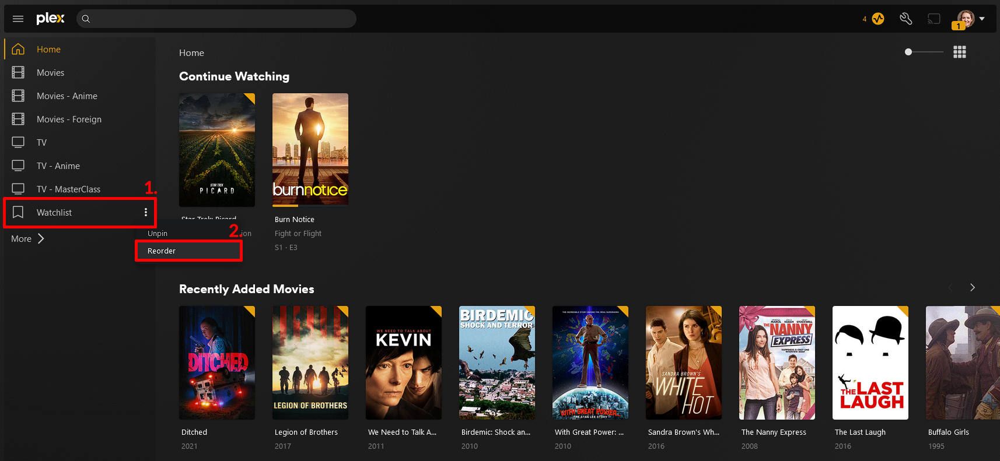
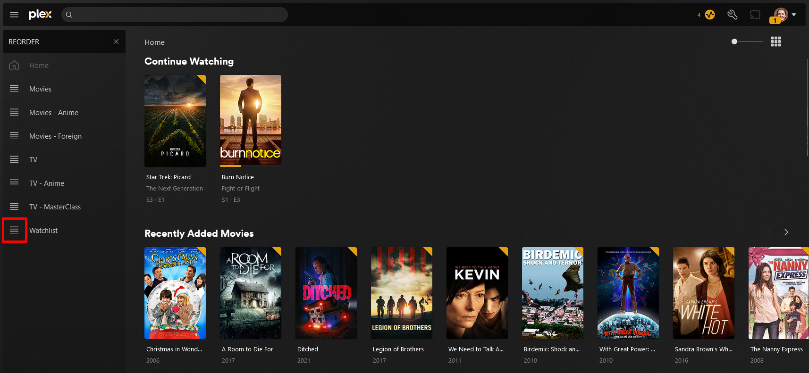

# Accepting Your Plex Invite

## How to accept your invite

- Go to [https://plex.tv](https://plex.tv/) and login with your Plex account credentials
- Access the Plex Web app by clicking on the Open Plex button

- Decide if you want to Sync your Watched Status if you have access to Multiple Servers

- Open Settings by clicking on the wrench icon in the top right

- Select *Manage Library Access*
- Find the Invitation received section and click the Checkmark after verifying the server is in fact the one you were expecting to see an invitation from
- Click the Home Icon to go to the Home Screen of Plex

## How to setup your libraries

- Plex has their own libraries and content, while it's a nice bonus it is easy to confuse a Plex Library with a custom curated one that has been shared to you
- Find the hidden ellipses next to the item you wish to **Unpin**. *(We recommend removing all Plex's items, as seen in the screenshot)*

- Click on the **MORE** button to find the server that was shared with you

*Please note that the server name can be different depending on which server you were added*

- Locate a desired library of interest that is shared with you
- Click the ellipses and **Pin** the desired library *(Repeat this for all libraries of interest)*

- In the upper left, click the **PINNED** menu item to return to the Home section of Plex

- You should see your pinned libraries listed on the home page, you can also reorder them as you see fit.

- Locate a desired library you wish to move
- Click the ellipses and select **Reorder**

- Now simply drag and drop the libraries as you see fit.

- Once all your ;ibraries are in the desired order, simply click the tiny “x” found here to exit the Reorder Process. You are now ready to enjoy your streaming.

