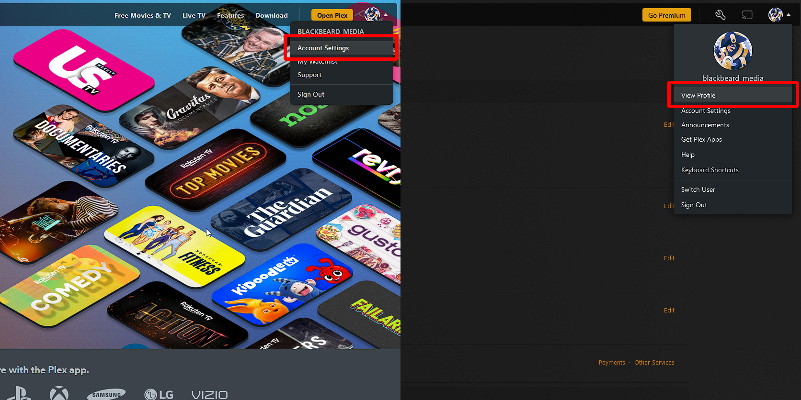

# Creating a Plex Account

Before you can start enjoying that extensive library of content, you'll need to create a Plex account. A Plex account allows you to access all of your streaming services. In this guide, we'll walk you through the steps to create a new Plex account and customizing it so you can start watching your favorite movies and TV shows right away. Whether you're new to streaming or a seasoned pro, our detailed instructions will help you get set up in no time. Let's get started!

## How to Create Your Account

1. Go to [https://plex.tv/register](https://plex.tv/register) and click on the "Register Free" button
2. You can continue with your Google, Facebook, or Apple account or you can enter in your e-mail address.
3. Create your password *(8 character minimum)*
4. Head to your e-mail to verify your account -- The verification e-mail will be from `noreply@plex.tv`
5. You're account is now created and verified!

## Customizing Your Profile

Your Plex profile is a way to personalize your streaming experience and showcase your personality to friends and family. While customizing your profile is not required, it can be a fun way to make your streaming experience feel more like your own. In this section, we'll show you how to customize your Plex profile by adding a profile picture, biography, and other information.

1. To begin editing your profile, head to [https://plex.tv/](https://plex.tv/), hover over your profile picture in the upper right corner and click on 'Account Settings'.
2. On this page, you can begin customizing your profile by setting your profile picture, username, full name, set up two-factor authentication, set your preferred audio & subtitle settings, and link other accounts.
  > There are a few settings on this page that we recommend changing:
  > 1. Turn on 'Sync my Watch State and Ratings'
  > 2. Unsubscribe from Plex e-mail subscriptions
  > 3. Enable experimental features if you are bold enough
3. After you are complete editing this portion, hover over your profile picture and click on 'View Profile'.

4. Click on the 'Edit Profile' button.
5. You can update the final part of your profile to manage privacy settings, which badges are displayed, include your location, a short biography, or a link to any other online presence.
