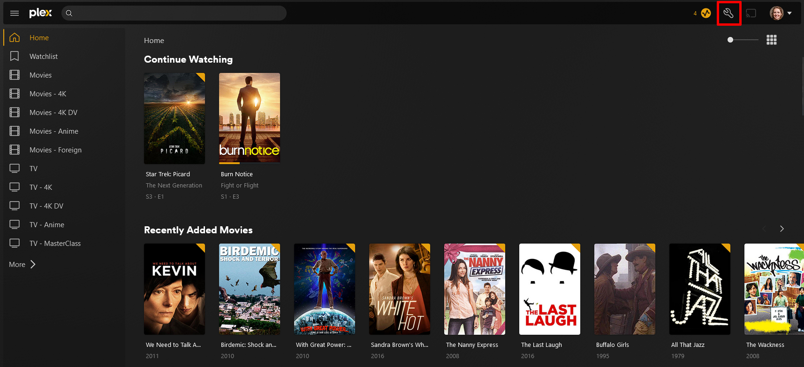

# Getting Started

## Creating a Plex Account

Before you can start enjoying that extensive library of content, you'll need to create a Plex account. A Plex account allows you to access all of your streaming services. In this guide, we'll walk you through the steps to create a new Plex account and customizing it so you can start watching your favorite movies and TV shows right away. Whether you're new to streaming or a seasoned pro, our detailed instructions will help you get set up in no time. Let's get started!

### How to Create Your Account

1. Go to [https://plex.tv/register](https://plex.tv/register) and click on the "Register Free" button
2. You can continue with your Google, Facebook, or Apple account or you can enter in your e-mail address.
3. Create your password *(8 character minimum)*
4. Head to your e-mail to verify your account -- The verification e-mail will be from `noreply@plex.tv`
5. You're account is now created and verified!

## Customizing Your Settings & Profile

Your Plex profile is a way to personalize your streaming experience and showcase your personality to friends and family. While customizing your profile is not required, it can be a good way to make your streaming experience feel more like your own. In this section, we'll show you how to change your Plex account settings as well as customize your Plex profile by adding a profile picture, biography, and other information.

1. To begin editing your profile, head to [https://plex.tv/](https://plex.tv/), hover over your profile picture in the upper right corner and click on 'Account Settings'.
2. On this page, you can begin customizing your profile by setting your profile picture, username, full name, set up two-factor authentication, set your preferred audio & subtitle settings, and link other accounts.

???+ tip "Recommended Settings"

    === "Two-Factor Authentication"

        Enabling two-factor authentication (2FA) on your Plex account adds an extra layer of security by requiring a code generated by a separate device in addition to your password when logging in. This helps prevent unauthorized access to your account, even if someone manages to obtain your password.
        
        1. Click "Edit" on the account settings page.
        2. Enter your password.
        3. Scan the QR code displayed on your screen using an authenticator app such as Google Authenticator.
        4. Save your recovery code in a secure location.
        
        Once you have set up two-factor authentication, you will need to enter a code from your authenticator app in addition to your password when logging in to your Plex account. This adds an extra layer of security to your account and helps protect your personal information.
        
    === "Sync Watch State & Ratings"

        Enabling Sync Watch History in Plex is a great way to keep track of what you've watched and get personalized recommendations for new content. By syncing your watched/played state and personal ratings with your Plex account, you can seamlessly transition between devices and servers while maintaining a consistent viewing experience. This feature also enhances your overall Plex experience by providing accurate data for Plex's Discover feature and any Plex Media Server you have access to.
        
        1. Click on the "Sync My Watch State and Ratings" box in the settings.
        2. Enable the feature.
        3. Plex will now sync the data of watched state and user ratings, which includes the Plex account user ID, the GUID for the title, the date and time the action was taken, and the state or rating submitted.
        4. Please note that Plex does not know what content is located on a personal Plex Media Server.

        
    === "Unsubscribe from Emails"

        If you're receiving too many emails from Plex or you simply don't want to receive any promotional emails, it's recommended to adjust your email subscription settings to unsubscribe from all emails. By doing so, you'll stop receiving all non-essential emails from Plex, including promotional emails, account notifications, and updates. This will help declutter your inbox and prevent unnecessary distractions while still allowing you to enjoy using Plex. 
        
        You can change your email subscription settings here on the account settings page and selecting "Email Preferences." From there, you can uncheck all email types that you do not wish to receive and click "Save Changes" to update your settings.

Additionally, users can manage their privacy settings and choose which badges are displayed on their profile, whether to include their location, and if they want to add a short biography or a link to any other online presence. This allows for further customization of their profile and control over the information shared with other Plex users.

1. Hover over your profile picture and click on 'View Profile'.
2. Click on the 'Edit Profile' button.
3. You can update the final part of your profile to manage privacy settings and all personal information.

## Accepting Your Invite

If you've been invited to join Plex, either by signing up for our service or through a friend or family member's invitation, you may be wondering how to accept the invite and get started. Luckily, accepting a Plex invite is a simple process that can be done in just a few clicks. In this section, we'll go over the steps to accept a Plex invite and get you on your way to enjoying all that Plex has to offer.

1. Go to [https://plex.tv](https://plex.tv/) and login with your Plex account credentials
2. Access the Plex web app by clicking on the 'Open Plex' button
3. Decide if you want to sync your watched status, which is useful if you have access to multiple servers
4. Open 'Settings' by clicking on the wrench icon in the top right
{ align=right }
